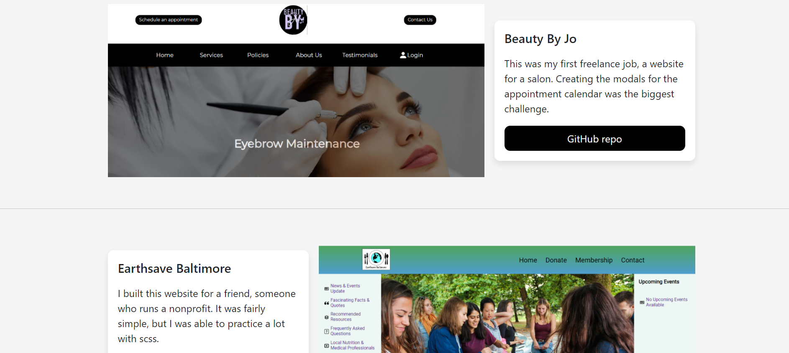
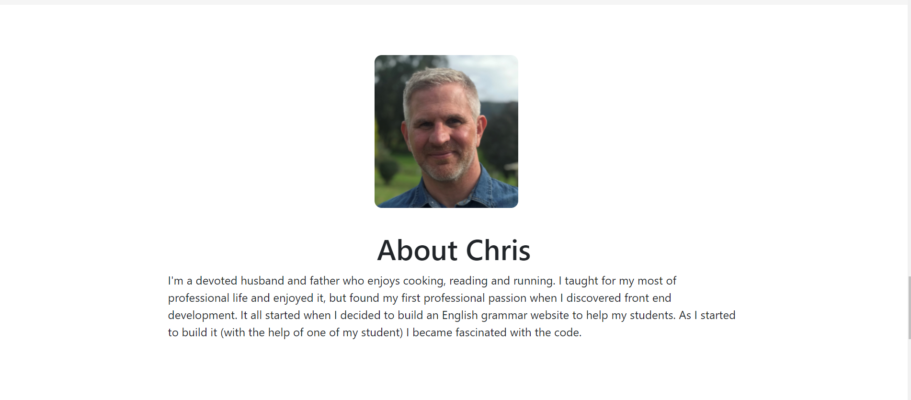

# portfolio

This is my portfolio. 
This project includes bootstrap and also the useContext React Hook

## How To Run This Project

1. Clone project (in terminal add `git clone https://github.com/ChrisDietrich405/portfolio`)
2. Install dependencies (in terminal run `npm install`)
3. Run project (in terminal run `npm start`)

Open [http://localhost:3000](http://localhost:3000) to view it in the browser.

The page will reload if you make edits.\
You will also see any lint errors in the console.

## Screenshots of Landing Page

Loading Page

